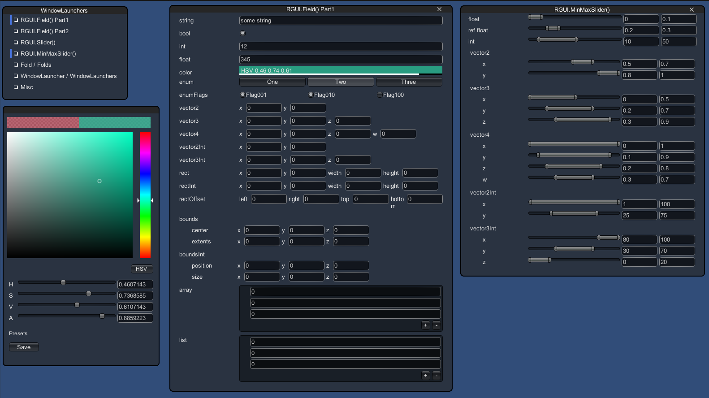
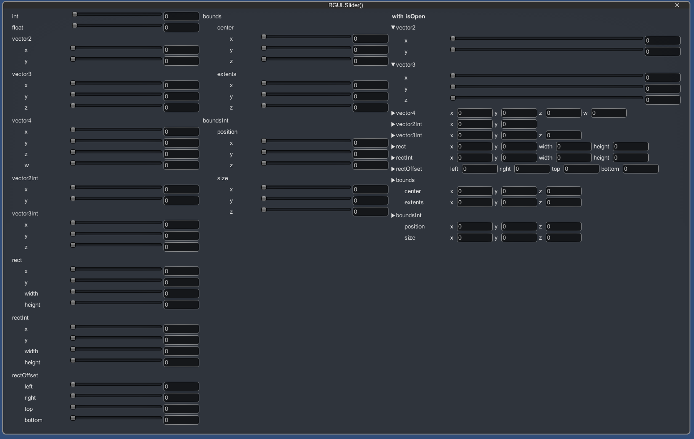
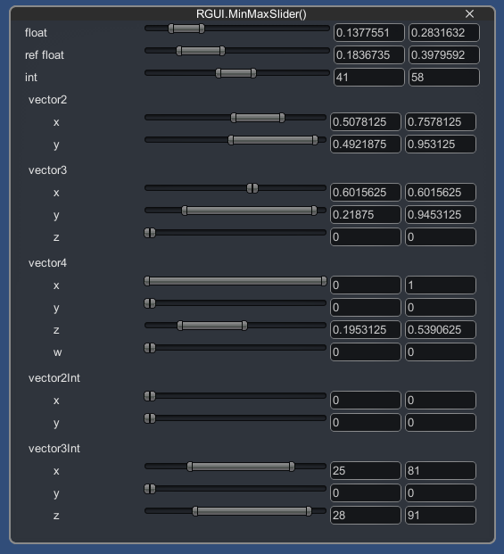
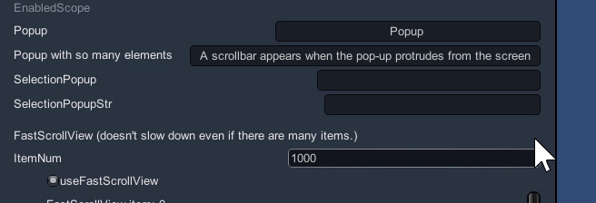
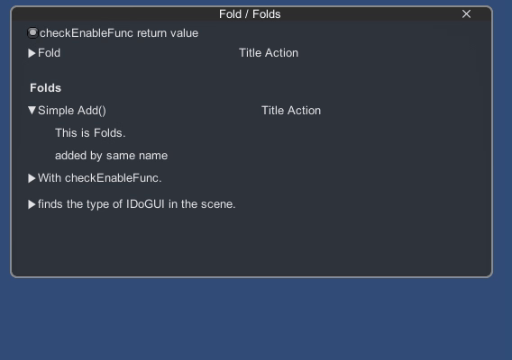
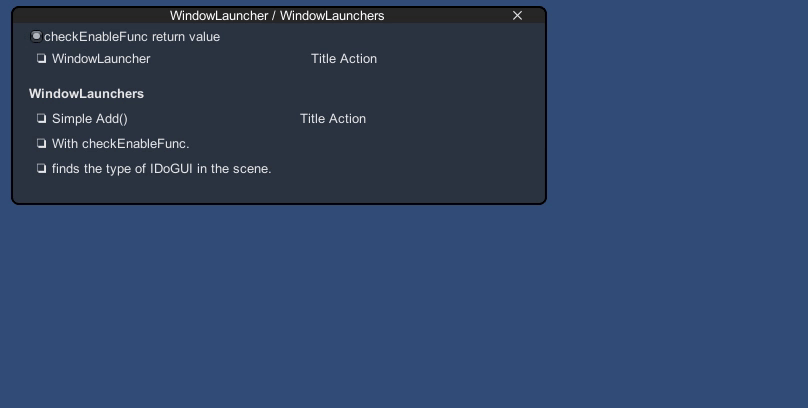
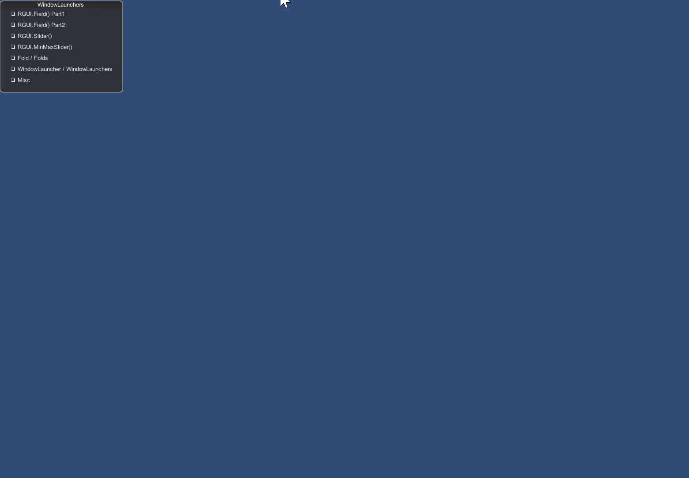

# RapidGUI
Unity IMGUI extensions for Rapid prototyping/development.



# Install
Download a `.unitypackage` file from [Release page](https://github.com/fuqunaga/RapidGUI/releases).

or

Using Pacakge Manager  
Add following line to the `dependencies` section in the `Packages/manifest.json`.
```
"ga.fuquna.rapidgui": "https://github.com/fuqunaga/RapidGUI.git"
```
# Getting Started
- Checkout the **RapidGUI/Example/RapidGUIExample.unity**
- And check the usage from the script below [**RapidGUI/Example/Scripts/**](Example/Scripts/)

# Function
## RGUI.Field()


```csharp
value = RGUI.Field(value, label);
```

- Display standard GUI according to type of value
- Right-drag label to edit numbers
- Color picker
- Array/List has a right-click menu like inspector

**CustomClass**  


```csharp
public class CustomClass
{
    public int publicField;

    [SerializeField]
    protected int serializeField;

    [NonSerialized]
    public int nonSerializedField;

    [Range(0f, 10f)]
    public float rangeVal;

    public string longNameFieldWillBeMultiLine;
}
        
```
```csharp
customClass = RGUI.Field(customClass, nameof(customClass));
```


## RGUI.Slider()

```csharp
value = RGUI.Slider(value, min, max, label);
```
- Display slider GUI according to type of numbers


## RGUI.MinMaxSlider()

```csharp
RGUI.MinMaxSlider(minMaxVal, minMaxRange, label);
RGUI.MinMaxSlider(ref floatMin, ref floatMax, rangeMin, rangeMax, label);
```
- Display min max slider GUI according to type of numbers
- RapidGUI defines some MinMax type(`MinMaxInt`,`MinMaxFloat`,`MinMaxVector2`...)
- You can also create your own MinMax type by inheriting `MinMax<T>`


## RGUI.SelectionPopup()

```csharp
selectionPopupIdx = RGUI.SelectionPopup(selectionPopupIdx, new[] { "One", "Two", "Three" });
selectionPopupStr = RGUI.SelectionPopup(selectionPopupStr, new[] { "One", "Two", "Three" });
```

## RapidGUI.Fold / Folds


```csharp
// Initialize
fold = new Fold("Fold");
fold.Add(() => GUILayout.Label("Added function"));
```

```csharp
fold.DoGUI();
```
  
## RapidGUI.WindowLauncher / WindowLaunchers

```csharp
// Initialize
launcher = new WindowLauncher("WindowLauncher");
launcher.Add(() => GUILayout.Label("Added function"));
```

```csharp
launcher.DoGUI();
```
- Open/Close window
- Resizable
- Has a close button


- WindowLaunchers automatically adjusts the layout when opening a window

## And more
Please check the usage from the script below [**RapidGUI/Example/Scripts/**](Example/Scripts/)

# Tips
## RapidGUIBehaviour?

A object placed as RapidGUI settings and update hooks.
If not in the scene, it will be generated automatically.

# Reference
https://github.com/mattatz/unity-immediate-color-picker
